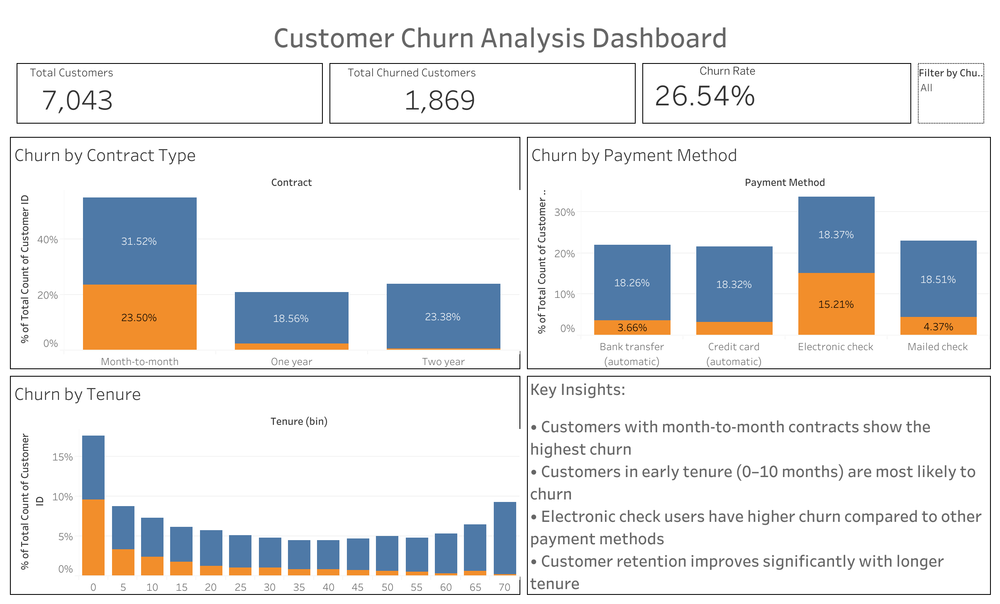

# 📊 Customer Churn Analysis

## 📌 Project Overview
This project analyzes customer churn behavior in a telecom company to identify key factors influencing customer retention and churn.

The goal is to provide actionable insights that help businesses reduce customer loss and improve retention strategies.

---

## 🚀 Business Problem

Customer churn leads to revenue loss and increased acquisition costs. This project aims to identify key drivers of churn and provide actionable insights to improve customer retention.

---

## 🎯 Objective

- Analyze customer behavior  
- Identify high-risk churn segments  
- Provide data-driven recommendations

  ---
  
## 🛠 Tools Used
- Python (Pandas, Matplotlib, Seaborn)
- Tableau (Dashboard Visualization)
- Jupyter Notebook

---

## 📊 Dataset
- 7,043 customers
- Telecom customer data
- Features include tenure, contract type, payment method, charges, etc.

---

## 🔄 Project Workflow

1. Data Cleaning & Preprocessing  
2. Exploratory Data Analysis (EDA)  
3. Feature Engineering  
4. Data Visualization  
5. Dashboard Creation (Tableau)

---

## 📈 Key Insights

- 🔴 Churn Rate: **26.54%**
- 📉 Customers with **month-to-month contracts** have the highest churn
- ⚡ Customers with **electronic check payments** churn more
- ⏳ Customers with **low tenure (0–10 months)** are most likely to churn
- 📈 Long-term customers show higher retention

---

## 📈 Dashboard

🔗 [View Interactive Dashboard](https://public.tableau.com/views/CustomerChurnAnalysisDashboard_17762814741980/CustomerChurnAnalysisDashboard?:language=en-US&publish=yes&:sid=&:redirect=auth&:display_count=n&:origin=viz_share_link)

## 📌 Business Recommendations

- Offer incentives for long-term contracts  
- Improve onboarding experience for new customers  
- Promote auto-payment methods  
- Focus on early customer engagement  

---

## 🔗 Tableau Dashboard
https://public.tableau.com/views/CustomerChurnAnalysisDashboard_17762814741980/CustomerChurnAnalysisDashboard?:language=en-US&publish=yes&:sid=&:redirect=auth&:display_count=n&:origin=viz_share_link

---

## 📁 Project Structure
